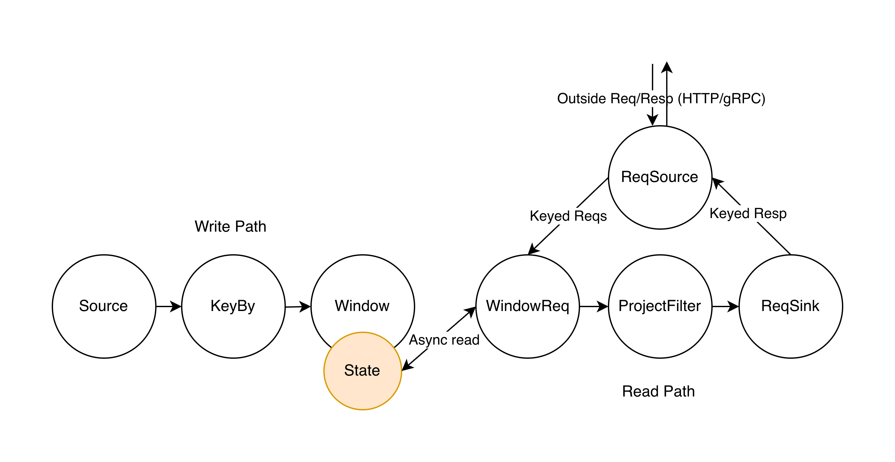

<h2 align="center">Volga — a unified real-time data engine</h2>
<p align="center">
  
</p>

<div align="center">
  <a href="https://github.com/volga-project/volga/blob/master/LICENSE"></a>
  <a href="https://volgaai.substack.com/"></a>
  <a href="https://github.com/volga-project/volga"></a>
  <a href="https://github.com/volga-project/volga"></a>
  <a href="https://github.com/volga-project/volga"></a>
  <a href="https://github.com/volga-project/volga/issues"></a>
</div>

**[Volga](https://volgaai.substack.com/)** is a ***split-path dataflow engine***: one SQL can run in **streaming**, **batch** (regular dataflow), or a serving-optimized **request** mode.

**Split-path request mode:** the planner cuts the dataflow graph into a **write path** (streaming workers maintain intermediate results in shared state) and a **read path** (request workers use those intermediate results to produce the final result on demand) — optimized read/write throughput and materialized state size, with a single query and no extra infrastructure.

One system ([Rust](https://www.rust-lang.org/), [Apache Arrow](https://arrow.apache.org/), [Apache DataFusion](https://github.com/apache/datafusion)), consistent logic and execution semantics, SQL everywhere — no DSL.

Check the *[blog](https://volgaai.substack.com)*, join *[Slack](https://join.slack.com/t/volga-project/shared_invite/zt-2vqyiyajo-zqgHZKXahQPuqqS~eD~A5w)*.

# The problem

Teams that run streaming pipelines almost always also need to **serve** the same logic (keyed lookup, often as-of a time), **backfill** it, and/or **derive offline data over history**. Today that means multiple systems: a stream processor (Flink / Spark Streaming), a serving store (Redis / KV), a batch engine, and often an orchestration layer (Chronon or custom) on top. Definitions and execution drift. Serving is a second product.

That stitch is most painful on entity-centric workloads — fraud, payments, ads, recsys, search, RAG — long per-key windows where online must match offline, streaming vs point joins, and so on. Volga is one engine for all three: stream, serve, backfill.

# Features

- **One SQL, three modes.** Streaming, request, and batch share operator logic. SQL compiles to a distributed dataflow graph running on **master + workers**, based on execution mode.
- **Split-path request mode.** The same query is cut into a live write path (maintain intermediate results in shared remote state) and a live read path (precompiled residual). No Redis, no second pipeline, no second SQL over a materialized view.
- **Exactly-once event-time processing.** Event-time watermarks and windows; Chandy-Lamport barrier snapshots for recovery.
- **Stateless workers.** Compute–storage separation: workers do not own operator state. Operators talk to store contracts (load, atomic commit, coherent snapshot, checkpoint). Operator-specific state data structures allow for selective I/O for optimized execution; backends own partitioning, fencing, etc. Lose a worker, attach another to the same store. Checkpoints are small state versions, not a large local RocksDB dump moving over the network.
- **Pluggable state backends.** Same contracts, different backends:

  | Backend                      | Role                                        |
  | ---------------------------- | ------------------------------------------- |
  | **In-memory**                | ships today; tests, local, in-process       |
  | **Scylla** (Cassandra-class) | latency-sensitive scenarios                 |
  | **SlateDB + object storage** | latency-tolerant scenarios with large state |

- **Optimized continuous sliding windows.** Tiles (window-specific intermediate results) store pre-computed aggregates, allowing for long (days, months, years) read/write-time aggregates without full recompute.
- **Extended native aggregates.** First-class in SQL, not app UDFs: `top`, `topn_frequency`, `top1_ratio`, plus categorical / conditional forms (`sum_cate`, `count_where`, `sum_cate_where`, …).
- **Kubernetes-native.** [kubevolga](kubevolga/README.md) Go operator and [`VolgaPipeline` CRD](kubevolga/config/crd/bases/volga.io_volgapipelines.yaml).
- **Rust + Arrow + DataFusion.** Columnar execution, Docker.

# Split-path

Request mode is a **generic SQL write/read cut**: bindings (entity key, as-of T, request row) decide where the graph splits. Streaming and batch keep the full graph.


| Path      | Runtime           | When it runs                   | What it does                                                |
| --------- | ----------------- | ------------------------------ | ----------------------------------------------------------- |
| **Write** | streaming workers | continuously, as events arrive | ingest, publish intermediate results into the state backend |
| **Read**  | request workers   | per request                    | residual eval against a coherent published snapshot         |


**Today** the cut is a simple single window: the planner finds the top window, the window operator becomes state-only (write path), a window-request operator does the lookup (read path). **Tiles** are those intermediate results — an I/O and CPU optimization for long `RANGE` frames. Raw rows stay authoritative; tiles are not a second source of truth.



**Joins** are the next candidate. A general cut optimizer for an arbitrary SQL (using query shape, runtime key stats, freshness, and so on) is an area of research.

# Compared with existing systems


|                   | Model                                           | State                                                   | Definition                           | Long RANGE windows                              | Serving                                                     |
| ----------------- | ----------------------------------------------- | ------------------------------------------------------- | ------------------------------------ | ----------------------------------------------- | ----------------------------------------------------------- |
| **Volga**         | native streaming + request; batch planned; Rust | pluggable remote state, stateless workers               | one SQL                              | tiling in-state (raw + nested granules)         | native request path on the same query                       |
| **Flink / Spark** | streaming / batch engines                       | local state + checkpoints (Flink ForSt is experimental) | SQL                                  | recompute-heavy for long continuous frames      | usually an external KV / queryable-state sidecar            |
| **RisingWave**    | streaming DB, incremental MVs                   | cloud-native remote state                               | SQL, then a second query over the MV | incremental MVs, not tile-covered RANGE serving | a separate query over the MV; not a binding-time plan cut   |
| **Chronon**       | Flink + Spark + KV composition                  | stream local + external KV                              | DSL (GroupBy / Join)                 | tiling via external materialization             | external serving layer                                      |
| **OpenMLDB**      | memory DB + Spark; no native stream engine      | local tablets                                           | SQL                                  | limited (no tiling)                             | built-in request SQL; more pull than push                   |


Volga is a general SQL dataflow (streaming and batch). Request is the same SQL with the plan split, so serving is not a second cluster. Compute–storage split means workers do not own the data.

# Example SQL

Stream it continuously, or serve the same query as point lookups:

```sql
SELECT
  user_id,
  count(*) OVER w_short AS purchases_1h,
  sum(amount) OVER w_long AS spent_30d,
  top(product_id, 3) OVER w_long AS top_products_30d,
  topn_frequency(product_id, 3) OVER w_long AS top_product_freq_30d,
  sum_cate(amount, product_type) OVER w_long AS spent_per_category,
  count_cate_where(product_id, product_type, product_type = 'ON_SALE')
    OVER w_short AS on_sale_count_1h
FROM events
WINDOW
  w_short AS (
    PARTITION BY user_id
    ORDER BY event_time
    RANGE BETWEEN INTERVAL '1 hour' PRECEDING AND CURRENT ROW
  ),
  w_long AS (
    PARTITION BY user_id
    ORDER BY event_time
    RANGE BETWEEN INTERVAL '30 day' PRECEDING AND CURRENT ROW
  )
```

Besides standard SQL aggregates, Volga supports `top` / `topn_frequency` / `top1_ratio` and categorical / conditional forms (`sum_cate`, `count_where`, `sum_cate_where`, …).

# Running a pipeline

Pipelines are [JSON](docker/pipeline_spec.demo.json) (or a Kubernetes [`VolgaPipeline` CRD](kubevolga/config/samples/volga_v1alpha1_pipeline.yaml)).

```json
{
  "execution_mode": "Streaming",
  "parallelism": 2,
  "sources": [
    {
      "table_name": "events",
      "schema_json": {
        "fields": [
          { "name": "user_id", "type": { "name": "utf8" }, "nullable": false, "children": [] },
          { "name": "event_time", "type": { "name": "timestamp", "unit": "MILLISECOND" }, "nullable": false, "children": [] }
        ]
      },
      "source": {
        "Kafka": {
          "bootstrap_servers": "localhost:9092",
          "topic": "events",
          "offset": "Latest",
          "poll_timeout_ms": 100
        }
      }
    }
  ],
  "sql": "SELECT user_id, count(*) OVER w AS n FROM events WINDOW w AS (PARTITION BY user_id ORDER BY event_time RANGE BETWEEN INTERVAL '1 hour' PRECEDING AND CURRENT ROW)"
}
```

Embedded Rust uses `PipelineSpec` / `PipelineSpecBuilder` and `compile_logical_graph`:

```rust
use volga::api::{compile_logical_graph, PipelineSpecBuilder};

let spec = PipelineSpecBuilder::new()
    .with_parallelism(2)
    .sql("SELECT word, COUNT(*) as count FROM events GROUP BY word")
    .build();

let graph = compile_logical_graph(&spec, None);
```

# Installation

```bash
git clone https://github.com/volga-project/volga
cd volga
cargo build
```

# Testing

Use [scripts/test](scripts/README.md) for profiles, Docker/Kube setup, filters, and stress runs.

```bash
scripts/test default
scripts/test kube
scripts/test stress --env kube --all --runs-per-shard 10 --shards 2 --fresh-cluster
```

# Running locally

```bash
docker build -t volga:latest .
docker compose up
```

Uses [`docker-compose.yaml`](docker-compose.yaml) and [`docker/pipeline_spec.demo.json`](docker/pipeline_spec.demo.json). Kubernetes: [kubevolga](kubevolga/README.md) operator + Kind + sample [`VolgaPipeline`](kubevolga/config/samples/volga_v1alpha1_pipeline.yaml) CR.

# Status

Volga is in **active development**. Streaming and request execution, RANGE windows, tiling, master/worker, checkpoint failure/restore with in-memory state, Docker, and a Kubernetes operator are real. Scylla and SlateDB backends, batch mode, backfill, regular aggregations (`GROUP BY`), and joins are on the roadmap.

# Roadmap

- [ ] Scylla backend
- [ ] SlateDB + object storage backend
- [ ] Batch execution mode
- [ ] Backfills
- [ ] Regular aggregations (`GROUP BY`)
- [ ] Joins (streaming / temporal + request / lookup + cut optimizer)
- [ ] Python client
- [ ] UI
- [ ] Proper testing (correctness via `sqllogictest`, deterministic simulation)
