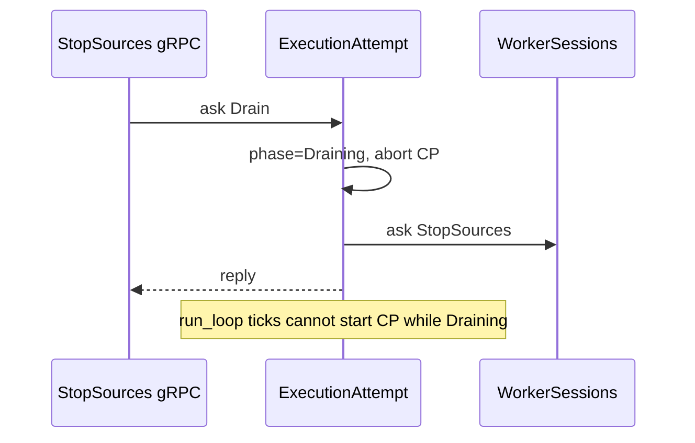
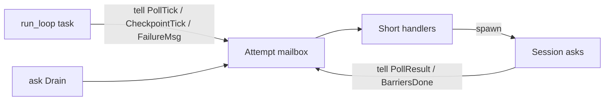
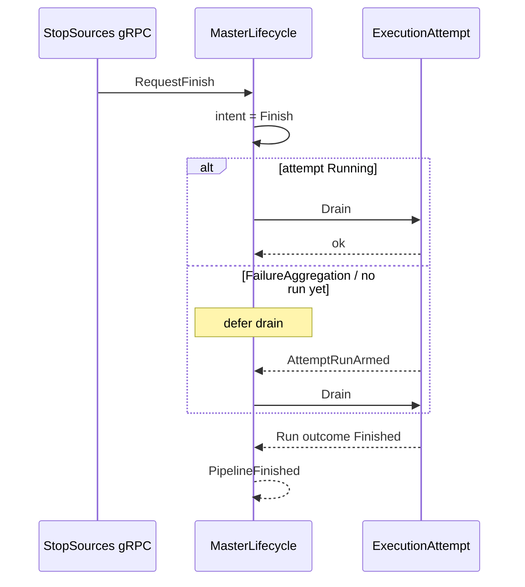

# From stress flakes to actors: notes for an engineering post

Draft source material (not a polished blog post). Captures the debugging path,
the concurrency bug, the shared-state smell, and the actor redesign on Volga’s
master control plane. Update facts/links as PRs merge.

**Rough timeframe:** Aug 2026  
**Primary PR:** [#195](https://github.com/volga-project/volga/pull/195) — ExecutionAttempt actor + StopSources Drain  
**Related:** [#200](https://github.com/volga-project/volga/pull/200) MasterLifecycle actor / Finish intent, [#193](https://github.com/volga-project/volga/pull/193) Worker-as-actor (stacked on #200), [#194](https://github.com/volga-project/volga/pull/194) CheckpointCoordinator, [#191](https://github.com/volga-project/volga/issues/191) / [#192](https://github.com/volga-project/volga/issues/192) follow-ups  
**Sink oracle / EO gap:** [#198](https://github.com/volga-project/volga/issues/198) (tighten after [#150](https://github.com/volga-project/volga/issues/150) 1PC)  
**Signature test:** `test_local_multi_worker_window_checkpoint_restore`

---

## 1. One-line story

We built CI stress tooling that could burn thousands of in-process checkpoint/
restore runs. That surface found a rare hang: cooperative drain (`StopSources`)
racing the master’s checkpoint/poll loop. The first fix shared attempt phase
across gRPC and the run loop; the durable fix was to stop co-owning control
state via locks and move ownership into kameo actors (attempt → sessions, with
checkpoint/worker/master plane still stacking).

---

## 2. Background: what Volga’s master was doing

Volga is a Rust streaming runtime. The **master** schedules workers, runs an
execution attempt loop (poll worker state, interval checkpoints, failure
aggregation / recovery), and exposes gRPC including **StopSources** — cooperative
finish: stop sources, drain the graph, wait for `PipelineFinished`.

Rough control flow before the redesign:

```text
MasterLifecycle::run
  └─ ExecutionAttempt (stack-local struct)
        select! { failure | checkpoint tick | poll tick }
        WorkerClient map + heartbeats → failure mpsc

MasterState (Arc + mutex bag)
  checkpoints, workers registry, lifecycle journal, …
  ← also poked from Master gRPC handlers (acks, StopSources, …)
```

The attempt’s run loop lived in one async task. Checkpoint and poll were arms of
a `tokio::select!`. Lifecycle waited on that loop for `Finished` / `Recover`.

---

## 3. The tooling that made the bug findable

### 3.1 Unified test runner

`scripts/test` wraps nextest profiles (`unit`, `inprocess`, `default`, `docker`,
`kube`, `stress`) so host and CI share filters, jobs, and env setup.
Documented in `scripts/README.md`.

### 3.2 Stress profile

`scripts/test stress --env local|kube` repeats a test (or suite) across shards,
writes per-shard logs under `target/stress/`, fails fast on first failure.

### 3.3 CI: machines × shards × runs

GitHub Actions `workflow_dispatch` / schedule on `rust-tests.yml`:

| Knob | Meaning |
| --- | --- |
| `stress_machines` | Isolated GitHub runners |
| `stress_shards_per_machine` | Parallel stress processes per runner (prefer 1) |
| `stress_runs_per_shard` | Iterations per process |
| `stress_test` | Exact test name (inproc) |

Scheduled shape that mattered for this bug:

- **Inproc:** 15 × 1 × 100 of `test_local_multi_worker_window_checkpoint_restore`
- **Kube:** 15 × 1 × 10 of the kube suite (alternating schedule)

On-demand example:

```bash
gh workflow run rust-tests.yml --ref split/drain-run-modes \
  -f profile=inproc-stress \
  -f stress_test=test_local_multi_worker_window_checkpoint_restore \
  -f stress_machines=15 \
  -f stress_shards_per_machine=1 \
  -f stress_runs_per_shard=100
```

Artifacts upload `target/stress/` per machine — essential when only 1/1500 runs
fails.

### 3.4 Why this test

`test_local_multi_worker_window_checkpoint_restore`:

- Multi-worker window pipeline
- Interval checkpoints
- Abrupt worker kill after a completed checkpoint
- Restore on a new attempt
- Harness `StopSources` → wait `PipelineFinished`
- Sink/oracle correctness (key-set / aggregates)

It couples **recovery**, **in-flight checkpoints**, and **cooperative drain** —
exactly the race surface.

---

## 4. The bug: PipelineFinished hang (and friends)

### 4.1 Symptom

Under stress (and occasionally in default CI), the harness waited on
`PipelineFinished` (or checkpoint settle) until timeout. Not a clean assert
failure — a **stuck control plane**.

### 4.2 Mechanism (simplified)

Two interacting facts:

1. **`StopSources` needs to abort in-flight checkpoints and prevent new ones**
   before/while sources stop, or the drain can wait on a checkpoint that will
   never complete (killed worker, fenced attempt, etc.).

2. **The run loop’s `select!` + RPC placement mattered.**
   - Slow `get_worker_state` under `biased` select could starve the checkpoint
     arm if ordered wrong.
   - More importantly for drain: if “phase / abort” lived only inside the run
     loop, a gRPC `StopSources` handler on another task could not safely
     coordinate without shared mutable state — and if abort was delayed behind
     a long in-loop RPC, settle/finish timed out.

A common timeline:

```text
interval CP N started (barriers in flight)
test kills a worker  OR  harness calls StopSources
poll / barrier RPCs slow or stuck
CP never Completes/Fails in the lifecycle journal
harness: wait_until_checkpoints_idle → timeout
  or StopSources without abort → PipelineFinished never arrives
```

### 4.3 First fix direction: shared `AttemptPhase`

Introduce `Running | Checkpointing | Draining` visible to both:

- run loop (gate checkpoint arm; clear checkpointing when idle)
- `StopSources` (set `Draining`, abort in-flight CP **before** worker fan-out)

Also: keep poll/checkpoint RPCs outside cancellation races; gate checkpoint
starts when draining; unify “all tasks in status” helpers.

This fixed the hang class but left a design smell: **control state co-owned via
atomics/mutexes on `MasterState` while the attempt was still a stack-local
struct.**

### 4.4 Stack / merge chaos (meta-lesson)

While landing this work:

- An earlier drain PR was merged into the wrong base and could not be reopened.
- gRPC centralization (#181) had been merged into a WM branch **after** WM hit
  `master`, so a drain-on-master branch temporarily carried cherry-picked gRPC
  commits. Fix: land gRPC on `master` ([#196](https://github.com/volga-project/volga/pull/196)), rebase drain so the PR diff is only the feature.

Worth a sidebar in a post: stress + stacked PRs needs ruthless base hygiene.

---

## 5. The smell: shared state vs single owner

Recurring pattern across master and worker:

| Smell | Example |
| --- | --- |
| Mutex held across `.await` / actor `ask` | Worker `Mutex` around task actor asks (#193) |
| Phase/flags on a shared bag so “someone else” can poke | `AttemptPhase` on `MasterState` |
| Stack-local owner + remote mutator | `ExecutionAttempt` in lifecycle vs gRPC `StopSources` |
| Protocol + store behind `Mutex` with “pending persist” dance | Checkpoints before #194 |

**Actor rule of thumb we converged on:**

- If it owns durable **control state** → actor (or clear single-threaded owner).
- If it only wakes the owner (timer, channel) → task/`tell`, not a domain actor.
- Prefer **message + ownership** over **lock + poke**.

Half-measure rejected: tiny mpsc “mailbox” beside kameo for drain only.

---

## 6. Redesign path (what we actually built)

### 6.1 Target shape (master attempt plane)

*As of #195 (later superseded for StopSources routing — see §14 / #200):*

```text
MasterLifecycle
  └─ ask Schedule / Run / Finish / Recover
        ExecutionAttempt (kameo)          ← owns AttemptPhase, run outcome
              ├─ WorkerSession(w1)       ← client, heartbeat, RPCs
              ├─ WorkerSession(w2)
              └─ run_loop task           ← timers + failure_rx → tell ticks

Master gRPC StopSources
  → MasterState.current_attempt: ActorRef
  → ask Drain  (phase=Draining, abort CP, session stop_sources)

MasterState
  → still a mutex bag for registry/journal/config (see #192)
  → checkpoints → CheckpointCoordinator actor on #194
```

### 6.2 ExecutionAttempt as actor (#195)

**Messages (public):** `Schedule`, `Run`, `Drain`, `Finish`, `Recover`  
**Internal:** `PollTick`, `CheckpointTick`, `FailureMsg`, `AggWindowEnd`,
`PollResult`, `CheckpointBarriersDone`

**Why `Run` is `DelegatedReply` + run_loop task (not a multi-minute `handle(Run)`):**

Kameo processes one message at a time. A long `select!` inside `handle(Run)`
would block `Drain` for the whole attempt. So:

1. `handle(Run)` stores `ReplySender`, spawns `run_loop`, returns `DelegatedReply`.
2. `run_loop` only turns wall-clock / failure channel into `tell`s.
3. Real work runs in short handlers; `complete_run` aborts the loop and sends
   the deferred reply (`Finished` / `Recover`).

**Phase lives only on the attempt actor.** `MasterState` holds
`Option<ActorRef<ExecutionAttempt>>`, not the phase enum.

### 6.3 WorkerSession actors (#195)

One session per worker for the attempt:

- Owns `WorkerClient` + heartbeat
- Messages: configure/start/run, `GetWorkerState`, `TriggerBarrier`,
  `StopSources`, reset/close/shutdown

Attempt orchestrates with `ask` / fan-out; **does not** hold clients directly.

### 6.4 Why spawn still wraps session fan-out

Even with sessions, this blocks the attempt mailbox:

```rust
// inside handle(PollTick) — BAD for Drain latency
join_all(sessions.ask(GetWorkerState)).await
```

So poll/barrier fan-out is still:

```text
handle(PollTick) → spawn { ask sessions; tell PollResult }
handle(CheckpointTick) → begin CP + set Checkpointing → spawn barriers
                       → tell CheckpointBarriersDone
```

Sessions own I/O concurrency; spawn keeps **awaiting** off the decision actor.
Same idea as run_loop: wake/collect off-mailbox, decide on-mailbox.

### 6.5 FIFO mailbox realism (do we need redesign?)

Default kameo mailbox is **bounded (64), FIFO**. `tell` does not mean
“runs immediately” — only “enqueued (or waits for capacity).”

For Drain correctness we concluded **no redesign required**:

- `Drain` sets `Draining` and aborts CP **before** awaiting `stop_sources`.
- Tick handlers are short or early-return when not `Running` / when `poll_in_flight`.
- Stale `PollResult` / `BarriersDone` guarded by `run.is_none()` / phase.

Optional hardening later (not topology change): ignore poll results when
`Draining`; coalesce ticks. Priority mailboxes only if stress shows Drain
latency problems.

### 6.6 Stacked follow-ups

| Work | Role |
| --- | --- |
| [#200](https://github.com/volga-project/volga/pull/200) | `MasterLifecycle` actor; Finish intent; exclusive `FailureAggregation` / `Draining` (§14) |
| [#193](https://github.com/volga-project/volga/pull/193) | Worker-as-actor + Close/dispose; stacked on #200 |
| [#194](https://github.com/volga-project/volga/pull/194) | `CheckpointCoordinator` actor; drop `PendingPersist` unlock dance |
| [#191](https://github.com/volga-project/volga/issues/191) | Full Worker-as-actor tracking (largely #193) |
| [#192](https://github.com/volga-project/volga/issues/192) | Retire `MasterState` mutex bag as control plane |

Intended merge order: **195 → 200 → 193 → 194**, then 192 as a larger arc.

---

## 7. Debugging narrative (for the post’s middle act)

Suggested beat sheet:

1. **Green locally, red in stress** — 15×100 finds what 1×1 never will.
2. **Artifact archaeology** — shard logs: CP started, kill, `StatePollFailure`,
   missing `CheckpointFailed`, settle timeout / missing `PipelineFinished`.
3. **False leads** — blame gRPC message size / inmem limits (#181 territory);
   those were real but separate; hang reproduced as control-plane race.
4. **Shared phase fix** — works, smells like the Worker mutex story.
5. **Actorize attempt** — phase ownership; Drain as `ask`.
6. **Stress still flakes** — mailbox blocked on barrier/poll fan-out; spawn
   results; then sessions as the clean I/O boundary.
7. **FIFO question** — document the guarantee we do and don’t have; why abort-
   first Drain is enough.
8. **PR hygiene** — wrong-base merge, gRPC orphaned off master, rebase so the
   feature PR is readable.
9. **Third hang class** — after Drain vs CP/poll was fixed, stress found
   Drain vs **failure aggregation** (§14); job intent had to leave the attempt.

---

## 8. Lessons (tweetable → expandable)

1. **Stress is a product feature**, not a luxury — same knobs in schedule and
   `workflow_dispatch`, logs as artifacts.
2. **`select!` order and RPC placement are load-bearing** under `biased`.
3. **If two tasks must mutate the same control flag, you don’t have an owner** —
   you have a race or a lock soup.
4. **Actors don’t remove concurrency; they move awaits.** Long work in
   `handle` is the new mutex-across-await.
5. **Timers should not be domain actors**; peers with I/O + identity should
   (WorkerSession).
6. **Stack PRs need a clean master base** or every review becomes archaeology.
7. **Interim shared state is OK if named and linked to the follow-up** (#191/#192).
8. **Idempotent upsert ≠ exactly-once set equality** — same key overwrites; it
   does not retract orphans past a restored cut. Stress will surface that as a
   different red than a hang; don’t “fix” the control plane for an oracle gap.
9. **One terminal intent per attempt** — Recover (failure window) and Finish
   (drain) must not share an attempt; job-level Finish intent belongs on the
   lifecycle supervisor, not as attempt-local deferral hacks (§14).

---

## 9. Code pointers (as of draft)

| Area | Path |
| --- | --- |
| Attempt actor + exclusive phases + Drain | `src/runtime/master/attempt/mod.rs` |
| run_loop, poll/CP / FailureAggregation | `src/runtime/master/attempt/execute.rs` |
| WorkerSession | `src/runtime/master/attempt/session.rs` |
| Lifecycle actor (intent, attempt loop) | `src/runtime/master/lifecycle.rs` |
| StopSources → `RequestFinish` | `src/runtime/master/mod.rs` |
| Lifecycle + attempt refs on state | `src/runtime/master/state.rs` |
| Stress runner | `scripts/stress-test`, `scripts/README.md` |
| CI stress jobs | `.github/workflows/rust-tests.yml` |
| Signature test | `src/tests/inprocess/checkpoint.rs` |
| Harness settle / finish | `src/tests/support/checkpoint/support.rs`, `kill_recovery.rs` |
| Sink / offline oracle | `src/tests/support/checkpoint/sink_oracle.rs` |

---

## 10. Open items / honesty box for the post

- Confirm final stress verdict on #200+#193 tip (15×100) before claiming “fixed
  in production CI.”
- Distinguish **hang** classes: Drain vs CP/poll (§4), Drain vs failure
  aggregation (§14), vs **oracle mismatch** (§13 / #198).
- WorkerSession + spawn is the thin version of “I/O not on decision mailbox”;
  Worker actor is #193; master plane mutex bag still #192.
- kameo `DelegatedReply` / bounded mailbox details are version-sensitive
  (we used kameo 0.16).
- §6.1 “ask Drain from gRPC” is historical; current routing is §14.

---

## 11. Possible titles

- “1,500 checkpoint restores and a Drain race: from shared phase to actors”
- “StopSources couldn’t Stop: stress-driven actorization of a Rust control plane”
- “Your `select!` is a scheduler: finding a PipelineFinished hang with CI stress”
- “Same stress job, second bug: idempotent keys and a non-transactional sink”

---

## 12. Diagram bank (mermaid for the post)

### Before: shared poke

```mermaid
sequenceDiagram
  participant GRPC as StopSources gRPC
  participant State as MasterState phase
  participant Loop as Attempt select loop
  GRPC->>State: set Draining + abort CP
  Loop->>State: read phase / start CP
  Note over GRPC,Loop: Co-ownership via atomics/mutex
```

### After: ask Drain



### Run interruptibility



### Sink overshoot after restore (not a hang)

```mermaid
sequenceDiagram
  participant Src as Sources
  participant Sink as Upsert sink
  participant Oracle as Offline oracle
  Note over Src: CP3 cut = N_cut
  Src->>Sink: windows for N_cut+1 … N_prekill
  Note over Src: kill / restore CP3 (rewind)
  Src->>Src: regenerate until StopSources<br/>final count may be &lt; N_prekill
  Oracle->>Oracle: expected from final records_generated only
  Note over Sink,Oracle: actual = expected ∪ orphans<br/>idempotent upsert does not delete
```

---

## 13. Sequel the same stress found: idempotency ≠ exactly-once

After the Drain/actor work, inproc stress on #195 mostly stopped hanging. The
next red was a **different** failure class — easy to misread as “recovery is
wrong” if you only look at `exit code 1`.

### Stress hit

- Run: [actions/runs/30978621025](https://github.com/volga-project/volga/actions/runs/30978621025)
  — job `inproc-stress (2)`, SHA `a4055e3` (pre–oracle-relax tip of #195)
- Test: `test_local_multi_worker_window_checkpoint_restore`, machine shard run
  **78/100** after 77 passes
- Error:

```text
window sink key-set mismatch: expected=2100 actual=2120 total_generated=2100
task_counts=[(0, 580), (1, 580), (2, 360), (3, 580)]
```

Master path for that run (compressed):

```text
attempt 0 → CP1, CP2, CP3 complete
worker-2 TransportDisconnect + worker-1 HeartbeatUnavailable
recover replace={worker-1}, attempt 1 restore=Some(3)
StopSources ok → PipelineFinished
oracle: key-set size fail
```

### What the oracle had already proved

Window assertion order matters for diagnosis:

1. For every **expected** key: present in sink + aggregates match
2. Then: `expected.len() == actual.len()` (local only; kube already skipped)

So all **2100** offline-expected rows were correct. Failure was **+20 orphan**
keys only — overshoot, not missing data or wrong aggregates.

### Why “we use idempotent keys” does not imply exact set equality

Upsert identity is `{datagen_key}|{timestamp}`. Idempotency ⇒ same key
overwrites. It does **not** retract sink rows when sources rewind.

```text
1. CP N completes — sources at cut N_cut
2. Before kill — sources continue; windows for N_cut+1 … N_prekill land in sink
3. Kill / restore from CP N — sources rewind to N_cut; sink is not cleared
4. Restored attempt runs to StopSources/finish
   final records_generated can be below pre-kill high water (task 2 → 360 vs
   peers at 580 in the failing run)
5. Offline expected = materialize(final task counts only)
6. actual = expected ∪ orphans  →  overshoot
```

Recovery did not “mint different keys for the same events.” It **never
regenerated** those post-cut events again, while the non-transactional upsert
sink kept them. Pass-through already documented this
(`TODO(exactly-once)` in `sink_oracle.rs`) and allowed overshoot; window local
still required exact equality — inconsistent with kube and with the sink model.

| Symptom | Interpretation |
| --- | --- |
| Missing expected keys / wrong aggregates | Runtime correctness bug — fail hard |
| Extra keys only after kill/restore | Known gap until sink commit is checkpoint-aligned |

### What we did / what waits on 1PC

- **Issue:** [#198](https://github.com/volga-project/volga/issues/198) — linked to
  [#150](https://github.com/volga-project/volga/issues/150) (2PC/1PC InMemoryStorage sink)
- **Interim:** relax window oracle to match pass-through — `expected ⊆ actual`,
  allow overshoot; still fail on missing / bad aggregates (#195 follow-up commit)
- **After #150 lands:** tighten **exact** key-set equality again for pass-through
  and window checkpoint tests (local + kube). That is the real “EO” check; the
  interim policy is honesty about today’s sink, not a permanent product claim.

### Why this belongs in the same post

Same CI product, same signature test, same week: stress first found a **control-
plane hang** (Drain vs run loop), then — once that path finished reliably —
exposed a **sink semantics** gap that single-run CI rarely hits. Two bugs, one
tooling story; mis-attributing the second as an actor regression would have sent
us hunting the wrong layer.

---

## 14. Sequel again: Drain vs failure aggregation (job intent)

After §4’s Drain-vs-CP/poll hang was fixed and Worker Close/dispose races were
hardened on #193, the same 15×100 window stress still produced
`timed out waiting for lifecycle event: PipelineFinished` — with a **different**
mechanism. Worth keeping as a third failure class for the post.

### Stress hit (compressed)

- Runs on #193 tip while Drain/Recover still co-owned the attempt, e.g.
  [actions/runs/31088119392](https://github.com/volga-project/volga/actions/runs/31088119392)
  job `inproc-stress (15)`, run **19/100**
- Timeline pattern:

```text
attempt 0: CP1 ok → kill worker-1 → FailureAggregation → Recover replace={worker-1}
attempt 1: restore=Some(1), Schedule/Run arms
           peer-connect TransportDisconnect (worker-1 → worker-2 gRPC) opens
             FailureAggregation window
           harness: AttemptRunning + CP idle → StopSources (Drain)
           AggWindowEnd ignored or Recover diverted mid-drain
           workers Close/cleanup → master polls tcp-fail / stale attempt
           → never PipelineFinished
```

Interesting detail: **`Failure window ignored … (draining)`** in logs meant the
“don’t Recover while draining” guard *worked* — and still hung. The bug was not
only Recover stealing Finish; **aggregation also starved finish observation**
(poll results gated while `aggregating`), so by the time the window cleared,
workers had already exited.

### Why patches piled up

Local attempt-level rules kept fighting each other:

| Patch | Intent | Hole |
| --- | --- | --- |
| Ignore Recover while `Draining` | Finish owns the attempt | Aggregation still blocked polls; workers gone before `Finished` observed |
| Clear aggregation on Drain entry | Unblock polls | Dropped a real Recover intent; still mixed two terminals on one attempt |
| Reject `StopSources` while aggregating | Recover wins | Leaked an internal debounce as a public API error; harness retry felt wrong |

Root smell (same as §5): **two terminal intents on one attempt** — failure
window → `Recover`, cooperative stop → `Finished` — with no supervisor owning
job-level “please finish.”

### What we converged on (#200)

**Two state machines, not attempt-local deferral:**

1. **Job (`MasterLifecycle` actor)** — intent `Run` | `Finish`.  
   `StopSources` → `RequestFinish` (always accepts once execute started).  
   Drain is issued only when the current attempt is stably runnable; after
   recover, `AttemptRunArmed` re-tries drain if intent is still `Finish`.
2. **Attempt** — exclusive phases  
   `Running` | `Checkpointing` | `FailureAggregation` | `Draining` → one
   terminal (`Recover` or `Finished`).  
   `Drain` accepted only from `Running`/`Checkpointing`.  
   Failure aggregation window **kept** (batch replace-set); it must not freeze
   observation, and must not overlap `Draining`.

```text
Master gRPC StopSources
  → lifecycle.ask(RequestFinish)     // intent = Finish
  → try Drain when attempt Running
  → if FailureAggregation / recovering: wait; drain on next AttemptRunArmed

ExecutionAttempt
  Running ──fatal──► FailureAggregation ──window──► Recover
         └──Drain──► Draining ──poll Finished|Closed──► Finished
```

**Not required for the model:** attempt-local `finish_requested`. That is just
a deferred mailbox on the wrong actor. Job intent on the supervisor is the
clean version of the same idea.

**Stacking for review:** #200 (master) under #193 (worker) — little code
interference; stress needs both planes green.

### Details worth stealing for the post

- Harness contract was always “stable `AttemptRunning` → one StopSources →
  `PipelineFinished`.” It never promised StopSources during recovery; the race
  was restore peer-connect fatals landing in the same millisecond as finish.
- `AttemptRunning` is a weak “healthy” signal after restore (tasks Run before
  all peer transports are up).
- Actor serialization already removed data races; the remaining bugs were
  **ill-defined state transitions** (overlays: `aggregating` flag on `Running`
  while also `Draining`).
- Naming: `Aggregating` → `FailureAggregation` so the phase reads as the
  product feature, not a generic buffer.

### Diagram (after #200)



---

*End of notes. Trim ruthlessly for the public post; keep failure logs and one
concrete timeline as the emotional center. Hang (§4) + aggregation (§14) +
overshoot (§13) are three classes if the post argues “stress finds classes of
bugs.”*
